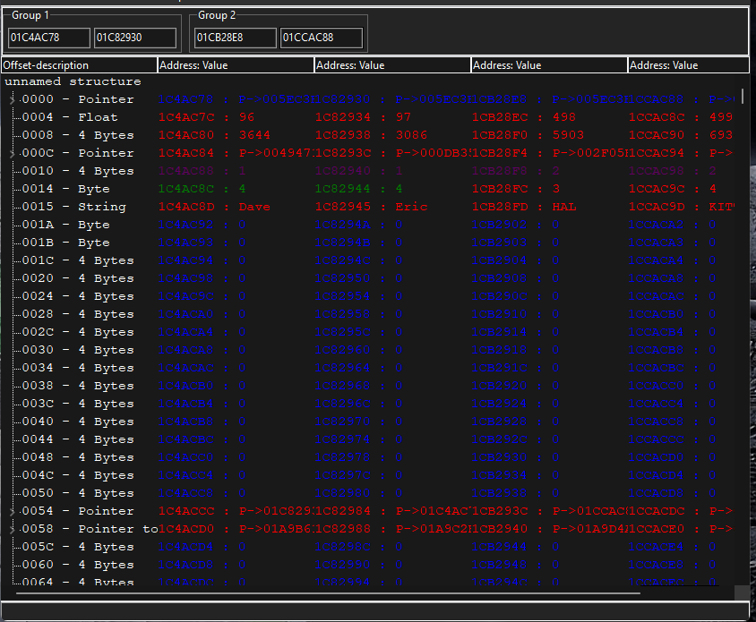

# The ninth step

This is the last step in this tutorial. And will help you with understanding how to actually use cheats in a "game". We need to compare the two teams and find some distinctive difference between those groups. If you try to win normaly and select the *reset game and play*. You are gonna lose, so lets create a **GODMODE** for our team.

## First part

In the first part we need to find the address of each player HP. So scan for **Float** and the value of the HP. If you didnt hit the players yet and youll put 100 in, youll find both at the same time. Same for the enemy team. Add them all to your cheat table.

## Second part

Now that we have found the addresses of the HP. We need to find address of each player it self. To do this click on one of the players and press *F6* - this opens the *what writes to this address*. Try to use as many keybinds as you can. Now hit the player you chose. And youll see the code that hits the player. 

In my case i see:

```
mov [ebx+04],eax
```

Which tells me that the HP is not subtracted here, but somewhere else and than its moved into the HP. But this is not a problem.

## Third part

Now that we have the offset to the player address. From the last step - in my case its *0x04*. We are gonna define a structure that will be devided into the two groups. Open **Memory View**, Press "Ctrl+D" to open structure dissect, Press "Ctrl+a" to add one more address, Press "Ctrl+g" to add another group, Click into the second group and press "Ctrl+a". Now that we have 2 Groups with two addresses in each, lets fill them.

Using the offset from earlier copy and paste each address of the HP to the structure. After you done this, go and sub the offset from each address. Once you are done, press *structures* -> *define new structure*. This will bring up a new window with all the data bellow the address. We are looking for something that is red - meaning it has differend values between the groups.

<br>



Here you can see different values at offset 0x10. In group one there is 1 and in group 2 is 2. So we know that we can compare the two groups wia this offset.

## Forth part

Now that we have the compare, its gonna be easy. Close all the windows as we dont need them anymore. And open a F6 on of the players again. Now follow the code to disassembler and make AOB injection. Now we need to somehow make it so that they take dmg and we dont.

My code:

```
newmem:

code:
  cmp [ebx+10] 1        // are you in my team?
  je x                  // go to x
  mov [ebx+04],eax
  fldz 
  jmp return

x:                      // same but dont take dmg
 fldz
 jmp return

INJECT:
  jmp newmem
return:
registersymbol(INJECT)
```

All Im doing is, skipping the part where my team takes dmg when this part of the code is executing for my team.

## Final

Add it to your cheat table and turn it on. Go and pres the button where it says you are gonna play it. BOOM. you WON. 

Now when you click next its gonna convert you to the second tutorial - THE GAME.