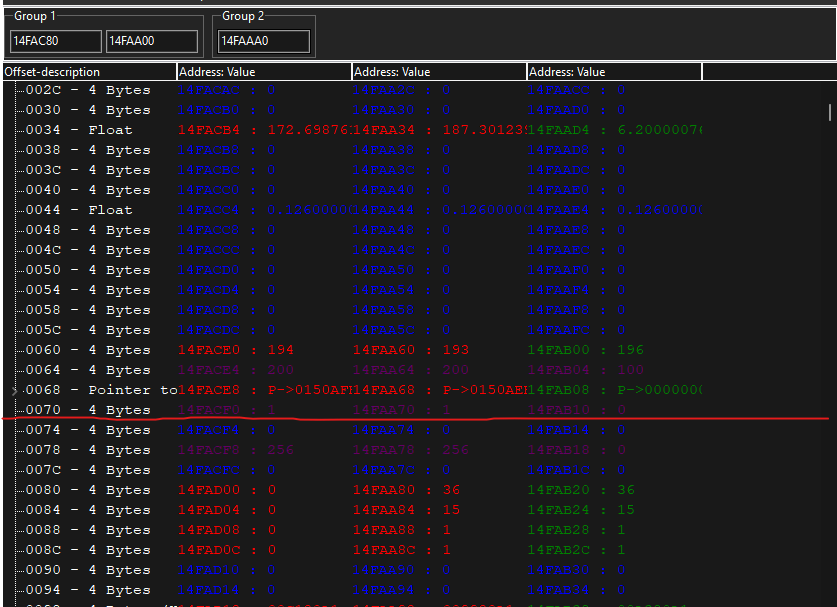

# The second game

In the second game, you have 2 enemies that will shoot you when you shoot them. They deal much more dmg than you do. So there is no way you can win... right? Lets make GODMODE with ONETSHOTS.

## First part

Go and look for 4-byte unknown initial value. And each time you shoot one enemy scan for decreased by 1. Once you got it, find out what writes to that address. Open it in a disassembler and look what it does. You will see that it subtracts value from the HP offset.

```
sub [rax+60],edx
```

So all we need to do is comment this out... right? Wrong! If we just comment this out. We will give GODMODE to everyone. Because this part of code is used by every player in the game. To separate us from enemy, we need to find some unique value that sets us apart from them. To do that you need find your HP too.

## Second part

Now lets find the unique value. To do that open memory view and open structure dissect. Create two groups one with the enemyes and one that has you. Take the HP addresses and sub the offsets from the code. Fill them in and create the structure. Look for some of that unique value.



And here you can see at offset 0x70 they have 1 and we have 0. So we got it. We just need to go into the code now and use it. 

So open what writes to this address on one the HP ones again. And open in disassembler, straight to auto assembler to AOB injection. And lets make the GODMODE with oneshots.

## Third part

Lets do the little coding we need to do.

```
newmem:

code:
  cmp [rax+70] 0        // is it me?
  je x                  // if yes go to x

                // ONESHOT
  mov [rax+60],0        // move 0 to their HP
  sub [rax+60],edx
  ret 
  add [rax],al
  jmp return

x:              // GODMODE - just copy the part that wont subtract HP
  ret
  add [rax],al
  jmp return

INJECT:
  jmp newmem
  nop

return:
registersymbol(INJECT)
```

## Final

Add this to your cheat table, activate it. And lets finish this level. Go next.
