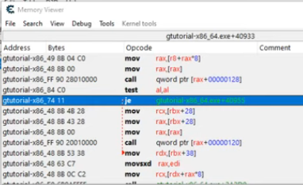

# The trird game

Now in this game we play a little diffrent game than the pervius 2. In this game you need to jump on all the platforms to turn them green. You might think that you can do it even without cheats. Go on but you will meet your end when you get all the platforms. All the enemies will suround the door you need to get thu. 

## First part

We need to make a GODMODE to win this. We need to make us unhittable for the enemies. So in this part we are gonna find some identifier that tells us when we are hit and than changing the code.

But as you can see we dont have any starting point for our scan. No HP no AMMO no nothing. So if we want to find the player object in memory, we need to scan for position. So just start a scan for unknown initial value that is float, as most cords are stored as floats. After you dont that, move a little to left and scan for increased value. Continue to do this with unchanged and decreased. Until you find your coords. This way we get our X - left/right.


## Second part
Now go and browse memory region and look for Y by jumping and looking what changes when you jump. Test that they are your coords by freezing them using the CE table. If they are yours you wont be able to move in the direction you froze it. Now look again in the memory region and die. Look for some bool that changes from 0 to 1 or from 1 to 0. Anything consistent that changes when you die. Add it and freeze it, go try what it does. I found 2 variables. One was IsDEAD and the second one was some respawn init. So I used F6 to find what writes to that address so I would know what happens when I collide with the enemies. There is some mov command. Which Im not rly interested in. We need to dig deeper. So open the command in the disassembler and right click it to use **break and trace**. Set it to 10k steps and select *step over instead of single steps*. Because we dont need to go inside any functions.

When you used the break and trace, you also need to trigger it by walking into a enemy. Your game will freeze as the CE will trace the steps. When your game un-freezes. No to the tab and rightclick to press expand all. Find the mov command and hide the arrow/function that has the original mov in it. As the function that is one above is the one we are looking for. It should be something like:

`
mov rdx, [rbx+38]
`

Click on this and go look for some jumps around this command.



There is the **je** command. So lets try to set it to just **jmp**. If you do this. You have GODMODE. So open your AOB injection and rewrite this je to jmp. And you have the GODMODE.

## Bonus - insta win

Its nice to have the GODMODE and not worry bout the enemies. But I find it very time consuming to jump around the map to get all the platforms green.

So to get the insta win. Respawn and scan for 1 in the 4-byte. As we are looking for the number of already pressed platforms. Next scan for 2 after you jumped on another platform. Continue doing this untill you get the variable. Check it by replacing it with the number of platforms, if the enemies move to the door, you got the right one. Just browse what writes to this and you will find that its just adding one to this variable. So just replace the one with 12 to look like this:

```
code:
  add dword ptr [rbx+00000088],12
  jmp return
```

When you activate this, you insta win when you respawn.

# Thanks

Thanks for following me thu this CE journey, I hope you enjoyed this as much as I did. Go and try do this by your self now.

Wish you well on your path to hacking

**GL HF**

QSM saying bye...